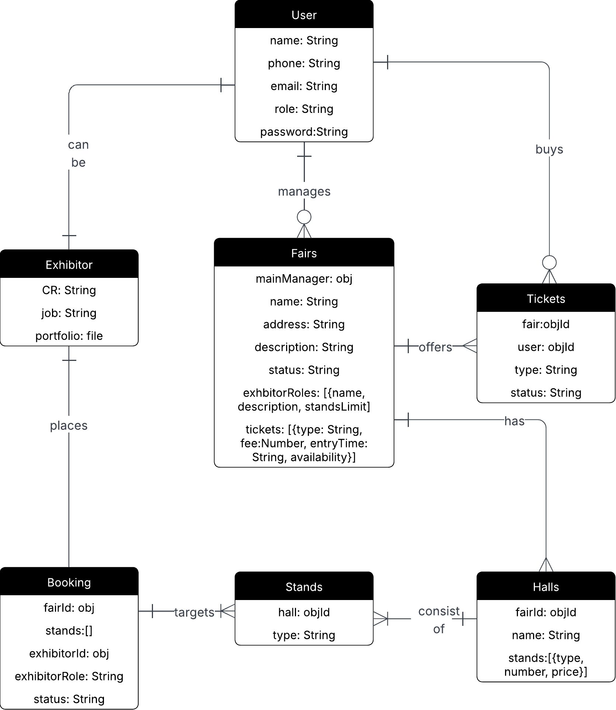
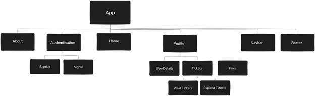

# The Book Fair
**Date** Aug / 24 / 2025  
**Developed By**  [Kawthar Mohammad](https://github.com/Kawthara-M)  
**Deployed Version** [The Book Fair](the-book-fair.surge.sh)

## 📌 Description
The Book Fair, a fairs management system developed to facilitate the process of managing book fairs in terms of finding participants and offering tickets. The platform is built with MERN stack and has three interfaces, one for the admin to manage fairs, another for attendees to book tickets for active fairs, and the last for exhibitors who wish to participate in fairs.

## 🚀 Getting Started

A first step for Fair-y project to see the light was planning, a critical stage to guide development. It mainly resulted in:

- **Entity Relationship Diagram (ERD)**: the main guide of schema and database managment.  

  

- **Component Hierarchy Diagram**: the cornerstone of building the frontend, designed with Excalidraw.  

  

- **To Do List**: A board to list tasks and track prograss.
  | [Notion]() |

- **Backend Repository**: GitHub repository for The Book Fair backend | [GitHub](https://github.com/Kawthara-M/Fair-y-backend) |

Following the planning, the development has mainly resulted in 2 main outcomes, a front-end and a backend developed and connected using the MERN Stack (MongoDB, Express, React, Node.js).  

## ⚙️ Technologies Used

- MongoDB
- Express
- React
- Node.js

## 🗺️ Wireframes

The following wireframes present a visual blueprint of the application's user interface and layout structure. Designed in a low-fidelity format, these wireframes focus on content placement and user interactions without incorporating final design elements such as colors, fonts, or images.  
| [Wireframes]() |

---

### ✨ **Future Enhancements**

- **Secure Payment Methods** : Fully functional checkout with secure gateways (credit/debit cards, Apple Pay, Benefit Pay).
- **Multi-language Support** : Arabic and English interface.
- **Sponsors Interface** : Garanting Access to sponsors who would like to fund a fair.

---

### **Credits**

#### **BackEnd**

- Password Validator: [npm package](https://www.npmjs.com/package/password-validator)

#### **FrontEnd**

- Password validator: [Geeks for geeks](https://www.geeksforgeeks.org/reactjs/create-a-password-validator-using-reactjs/)
- Country Codes: [REST Countries](https://restcountries.com/)

#### **Styling**

- Icons: [Flaticon](https://www.flaticon.com/)
- Loadings: [Css loaders](https://cssloaders.github.io/)
---

