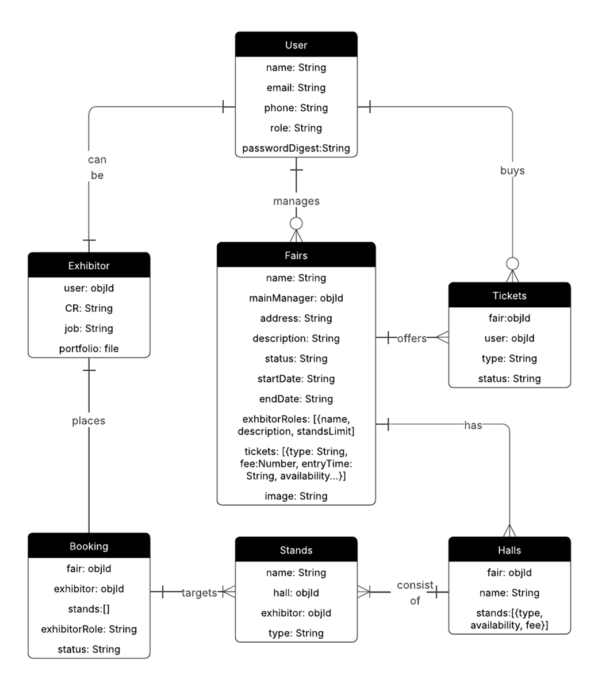

<h1>
  
  The Book Fair
</h1>

**Developer**  [Kawthar Mohammad](https://github.com/Kawthara-M)  
**Deployed Version** [The Book Fair](https://the-book-fair.surge.sh/)

## 📌 Description
The Book Fair, a fairs management system developed to facilitate the process of managing book fairs in terms of finding participants and offering tickets. The platform is built with MERN stack and has three interfaces, one for the admin to manage fairs, another for attendees to book tickets for active fairs, and the last for exhibitors who wish to participate in fairs.

## 🚀 Getting Started

A first step for this project to see the light was planning, a critical stage to guide development. It mainly resulted in:

- **Entity Relationship Diagram (ERD)**: the main guide of schema and database managment.  

  

- **Component Hierarchy Diagram**: the initial draft of the components required for the frontend, designed with Excalidraw.  

  

- **To Do List**: A board to list tasks and track prograss.
  | [Notion]() |

- **Backend Repository**: GitHub repository for The Book Fair backend | [GitHub](https://github.com/Kawthara-M/The-Book-Fair-Backend) |

Following the planning, the development has mainly resulted in 2 main outcomes, a front-end and a backend developed and connected using the MERN Stack (MongoDB, Express, React, Node.js).  

## ⚙️ Technologies Used

- MongoDB
- Express
- React
- Node.js

## 🗺️ Wireframes

The following wireframes present the main visual blueprints of the application's user interface and layout structure. Designed in a low-fidelity format, these wireframes focus on content placement and user interactions without incorporating final design elements such as colors, fonts, or images.  

### Home Preview
 

 ### Admin Add New Fair View
 

### Attendee and Exhibitor Booking Views
 
 

 ### Attendee and Exhibitor Profile Views
 
 

### ✨ **Future Enhancements**

- **Statistics View for Admin**
- **Sponsors Interface** : Garanting Access to sponsors who would like to fund a fair.
- **Secure Payment Methods** : Fully functional checkout with secure gateways (credit/debit cards, Apple Pay, Benefit Pay).
- **Multi-language Support** : Arabic and English interface.

## **Credits**

**BackEnd**
- Password Validator: [npm package](https://www.npmjs.com/package/password-validator)

**FrontEnd**
- Password validator: [Geeks for Geeks](https://www.geeksforgeeks.org/reactjs/create-a-password-validator-using-reactjs/)
- Country Codes API: [REST Countries](https://restcountries.com/)

**Styling**
- Icons: [Flaticon](https://www.flaticon.com/)
- Loadings: [LottieFiles](https://lottiefiles.com/)
---

